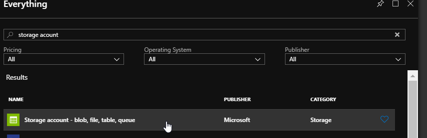
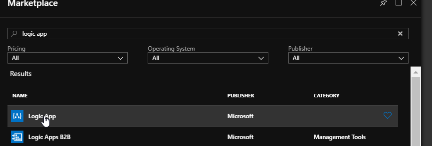
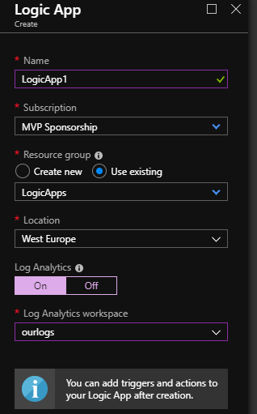
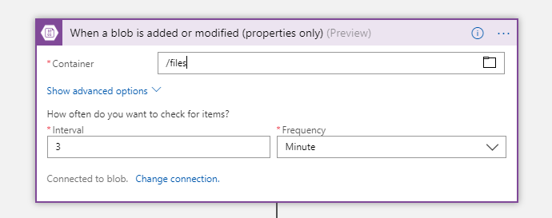
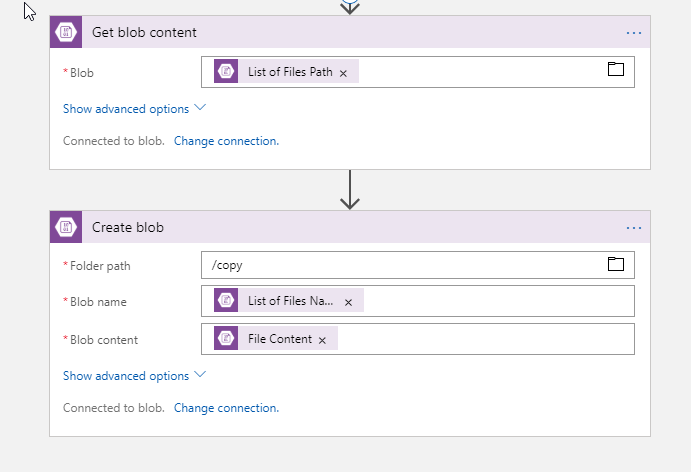

# Microsoft Azure LogicApps Workshop - First Workflow

## Exercise 1: Create Azure Blob workflow

In this exercise we will implement LogicApp that creates a copy of every new blob (file) in Azure Storage.

1. Open [Azure Portal](https://portal.azure.com) and navigate to your resource group.
2. Press **Add** button and type 'storage account'.
   
   

3. Create storage acocunt in your resources group, in region closest to your location. Mind storage account naming restrictions.
4. Create two Blob containers in storage account named 'files' and 'copy'.
5. Navigate back to resource group and press **Add** button and type 'logic app'.
   
   

6. Create logic app in your resources group, in region closest to your location.
   
   

7. Wait until resource deployment is completed and then press button to navigate to Logic App.
8. In Logic App designer use **blank logic app**. 
9.  Search for "Azure Blog Storage" connector and create trigger on added blobs to /files container.
    
    

10. Add "Azure Blob Storage" action to read file (blob) content.
11. Add "Azure Blob Storage" action to save back file in /copy container.
    
    

12. Save and run your workflow. Test how it works by uploading files to /files container.

## [UP](./../README.md)