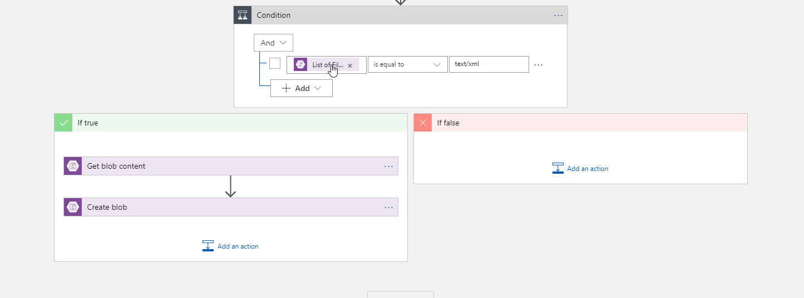
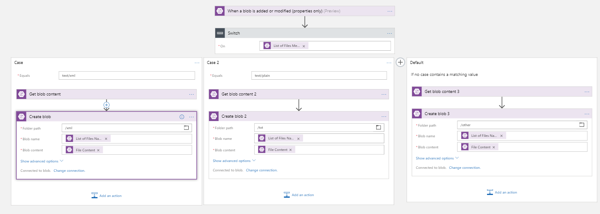
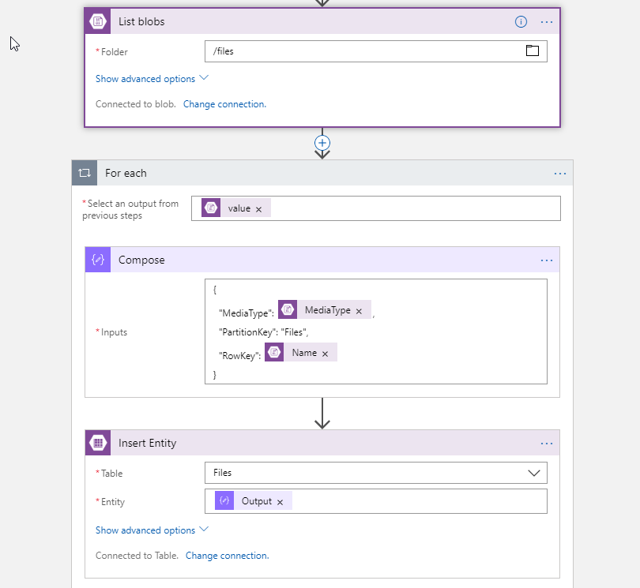

# Microsoft Azure LogicApps Workshop - Control Flow


## Exercise 1 : Using Conditions

1. Create logic app and use same trigger as in previous exercise.
2. As a first action add **Condition** action  from **Control** connector.
3. In condition set that MimeType of file must match "text/xml".
4. In "If true" brach set two actions from previous excercise. Leave "If false".
   
   

5. Test workflow by uploading different files of XML and non-XML type.

## Exercise 2 : Using Switch statements

1. Create logic app and use same trigger as in previous exercise.
2. As a first action add **Switch** action from **Control** connector.
3. Crate "xml", "txt" and "other" containers in Storage Account.
4. Switch over MimeType to save file copy to proper container.
   
   

5. Test workflow by uploading different files of XML, TXT and other types.

## ## Exercise 3 : Using Loops

1. Crate Table in Storage Account called Files.
2. Create Logic App with "When HTTP request is received" trigger and set HTTP method to GET.
3. As a first action "Read blobs" from /files container.
4. As a second action add **Loop** action from **Control** connector and loop over files.
5. In the loop first Compose JSON that will be inserted. Use following definition:
   ``` Json
   {
     "MediaType": @{items('For_each')?['MediaType']},
     "PartitionKey": "Files",
     "RowKey": @{items('For_each')?['Name']}
   }
   ```
6. Then insert JSON into Storage table called "Files" using "Insert Entity" action.
   
   
   
7. Run your workflow (you will get HTTP link after save).
8. Navigate to "Storage Explorer" in your Storage Account to verify added rows.

## [UP](./../README.md)
