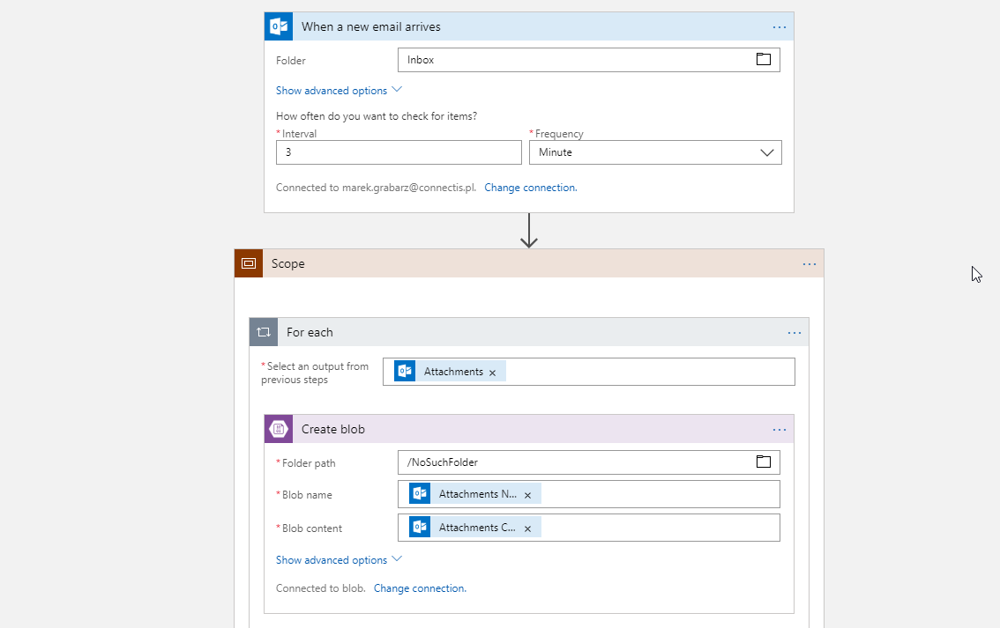
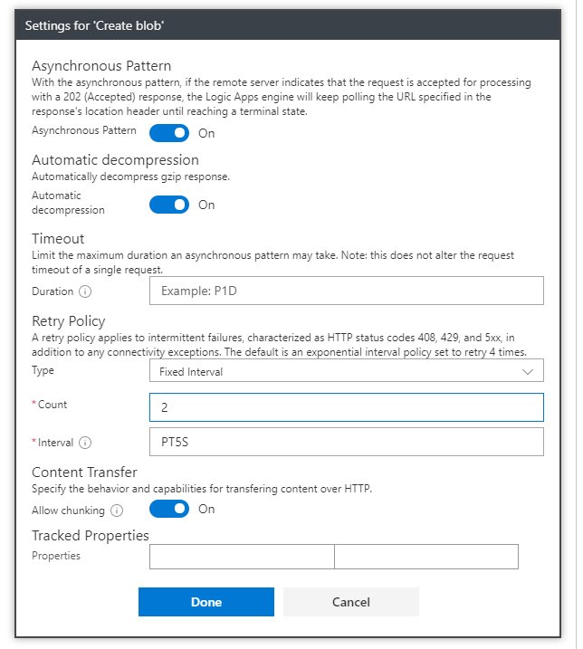
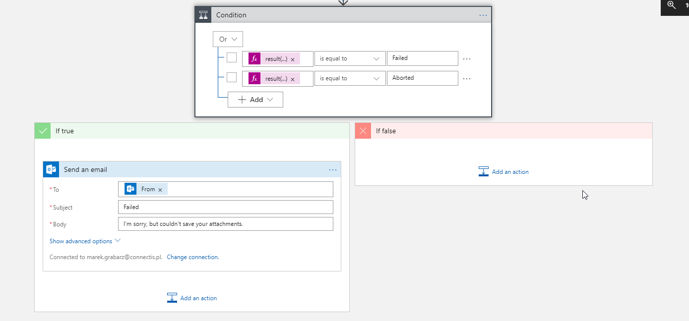
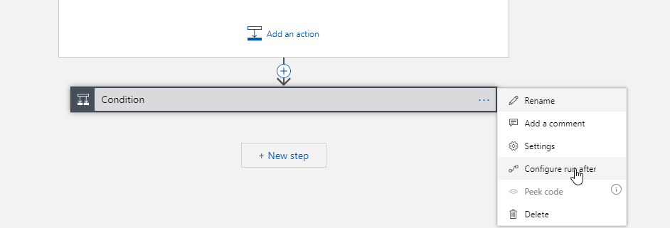
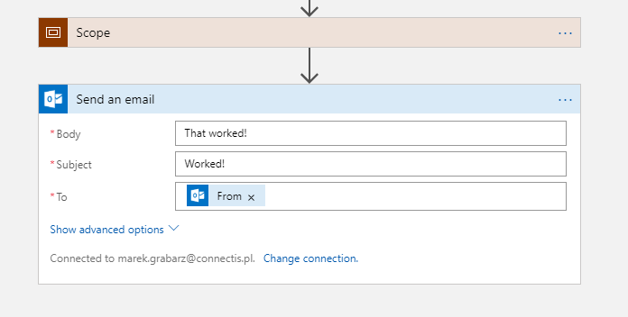
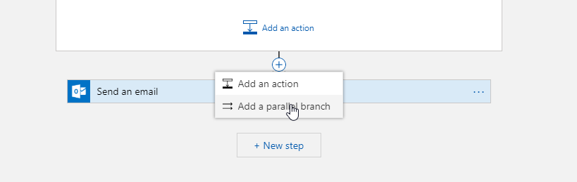
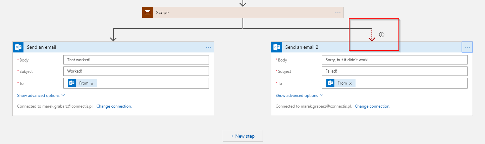

# Microsoft Azure LogicApps Workshop - Error handling

## Exercise 1 : Using scopes

1. Crate Logic App that is triggered by Email - it can be Office365, Microsoft account or Gmail.
2. As a first action use **Scope** from **Control** connector.
3. In Scope iterate through attachements.
4. Save each attachment to non-existent folder in Storage Account.
   
   

5. Configure retry policy of "Create Blob" action by changing its settings. Set fixed interval of 5 seconds with two retries.
   
   

6. After Scope action add Condition that sends Email back to Sender if attachment saving was unsuccessful. Use following expression to compare with Failed OR Aborted
   ```
   result('Scope')[0]['status']
   ```
   

7. Configure "Run After" options of Condition action, by checking all execution states.
   
   

8. Test your workflow by sending configured email without and with attachments.

## Exercise 2 : Exception handling with Run After

1. Reuse worfklow from Excercise 1.
2. Remove Condition action from workflow and replace it with Send Email. Email should contain success message since it will be sent only when errors are not detected.

   

3. Try running your workflow with attachments. Note error message:
   ```
   ActionConditionFailed. The execution of template action 'Send_an_email' is skipped: the 'runAfter' condition for action 'Scope' is not satisfied. Expected status values 'Succeeded' and actual value 'Failed'.
   ```
4. Create parallel processing branch to handle errors.
   
   

5. In new branch Send Email back to sender with failure notification.
6. Configure Run After of parallel branch to all status values BUT Successful. Note red dashed arrow.
   
   
   
7. Test your workflow by sending configured email without and with attachments.
   
## [UP](./../README.md)