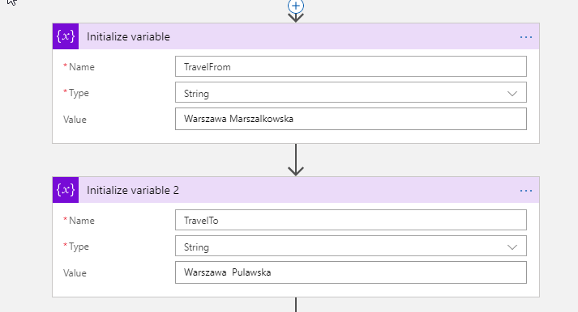
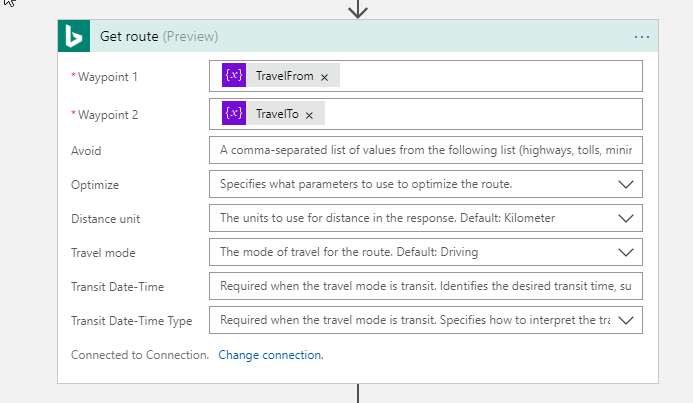
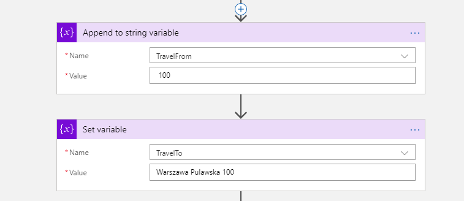
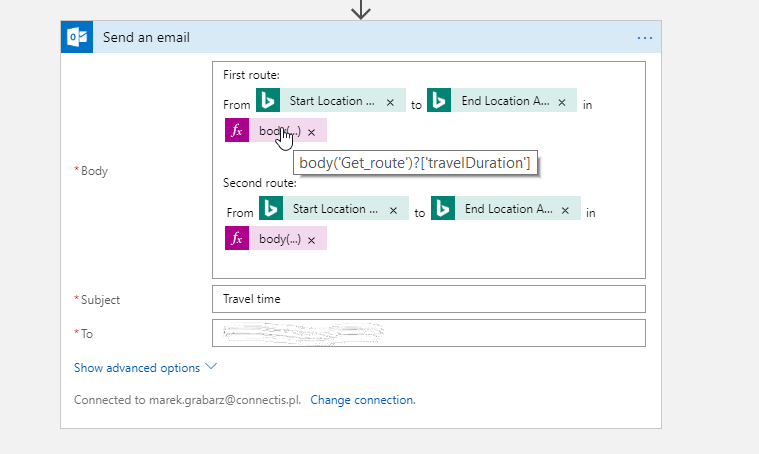

# Microsoft Azure LogicApps Workshop - Variables

## Exercise 1 : Variable declaration and manipulation

1. Create Logic App triggered by GET HTTP request.
2. As a first action declare 2 variables named TravelFrom, TravelTo. Specify type of variables as String, and put two different addresses as values.
   
   

3. Get Bing Maps Key following this instruction: https://docs.microsoft.com/en-us/bingmaps/getting-started/bing-maps-dev-center-help/getting-a-bing-maps-key
4. Add **Get Route** action from **Bing Maps** connector. Specify two waypoints using your variables.
   
   

5. Change variables. Append " 100" to TravelFrom variable and Set TravelTo variable to "Warszawa Pulawska 100".
   
   

6. Get new Route in next action.
7. Send routes information to your email.
   
   

8. Run your workflow.
   
## [UP](./../README.md)