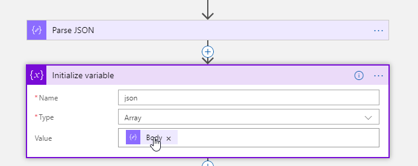
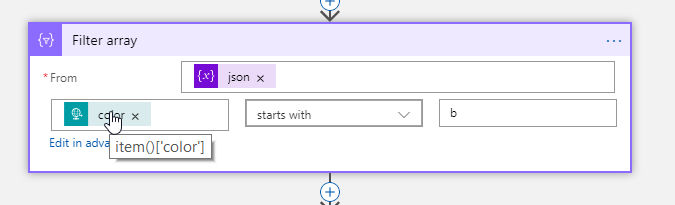
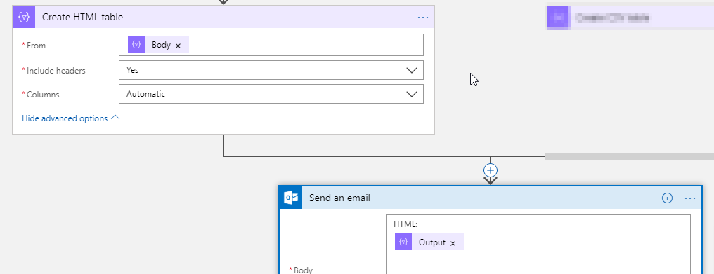
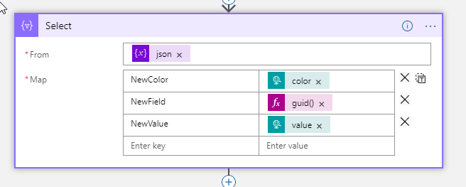
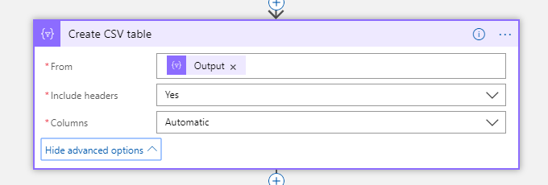
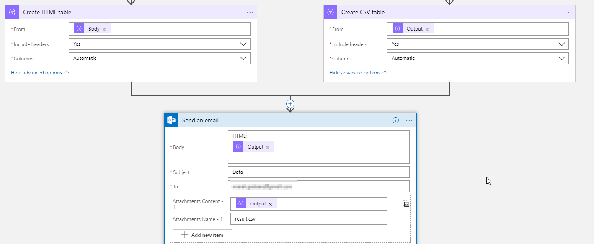

# Microsoft Azure LogicApps Workshop - Data processing

## Exercise 1 : Filtering data

1. Crate Logic App that is triggered by HTTP GET.
2. Crate **Parse JSON** action from **Data Operations** connector. Use 'sample payload to generate schema' function to generate schema based on following [file](Sample.json)
3. Save result to variable named json.
   
   ]

4. Filter colors from json array that start with "b" using **Filter array** activity.
   
   

5. Save result to HTML table and send with Email.
   
   

## Exercise 2 : Transform data

1. Create parallel branch under variable declaration.
2. Use **Select** activity to perform data transformation.
   
   

3. Save result to CSV file.
   
   

4. Send both HTML and CSV (as an attachment) via email.
   
   

## [UP](./../README.md)
