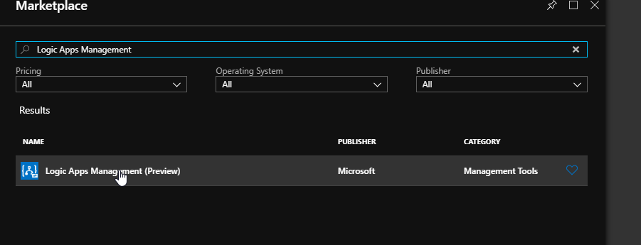
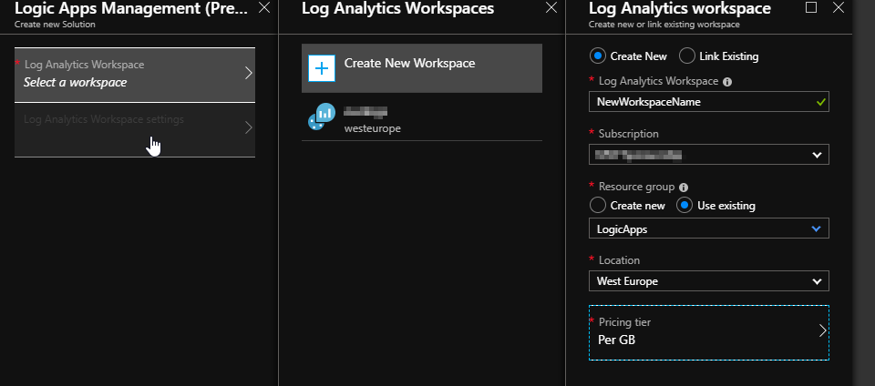
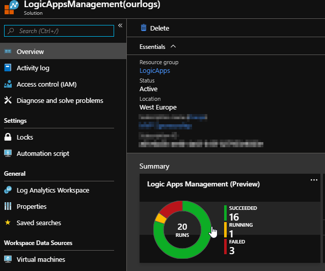
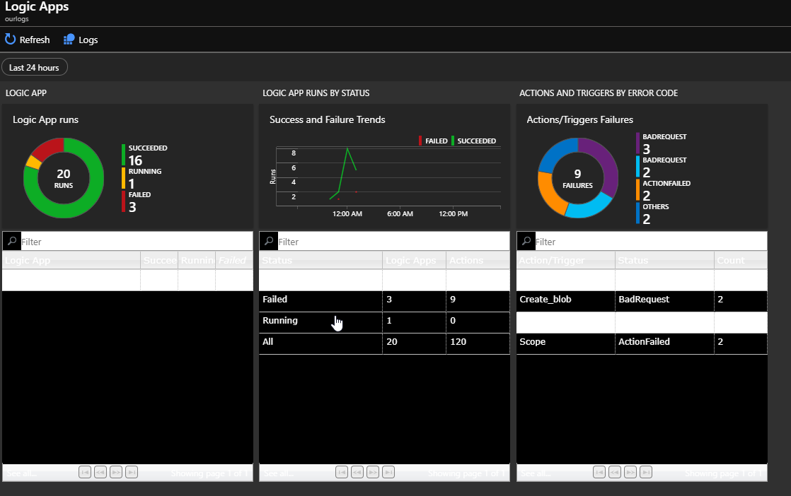
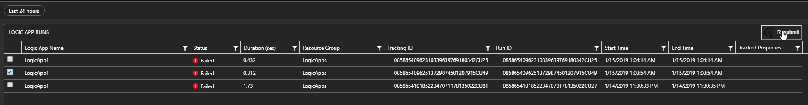

# Microsoft Azure LogicApps Workshop

## Exercise 1 : Creating Log Analytics solution for Logic Apps

1. Naviagte to your resource group and press **Add** button to add new resource.
2. Create Logic App Management solution by searching it in Marketplace.
   
   

3. Configure Logic App Management by attaching it to existing or new Log Analytics worspace.
   
   

4. Connect existing Logic Apps to new workspace using Logs blade in Monitoring section of your Logic App. You can also turn on Log Analytics when creating new Logic Apps.

## Exercise 2 : Analyze Logic Apps run history

1. Run your Logic Apps and review run history by clicking Summary of your Logic App Management solution.

   

2. Review details of execution and detected erros.

   

3. Resume failed Logic Apps.
   
   

4. Add Tracking Properties to your Logic App activities and discover them in the last column of aboventioned log.

## [UP](./../README.md)