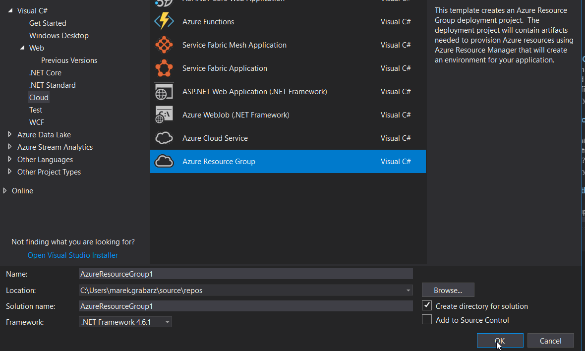
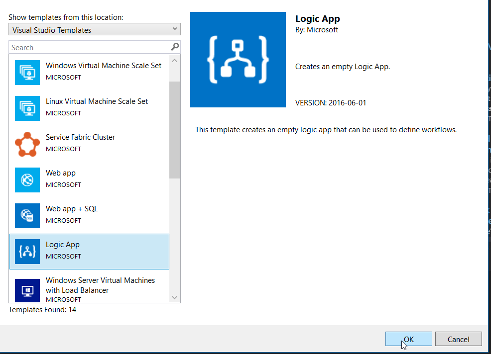
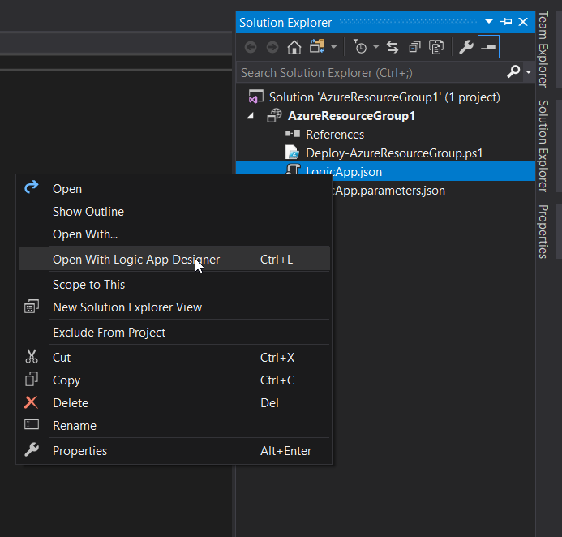
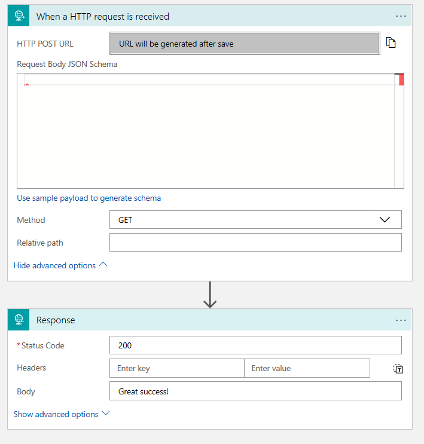
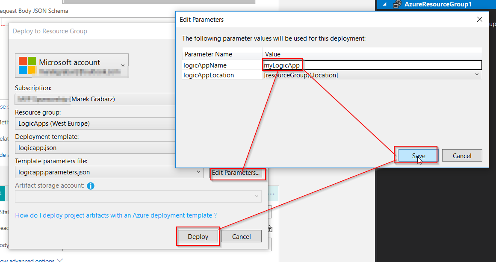

# Microsoft Azure LogicApps Workshop - Authoring Logic Apps in VS

## Exercise 1 : Create Logic App in Visual Studio

1. Open Visual Studio and use following menu option **File** -> **New** -> **Create**
2. Crate project of type **Azure Resource Group** from **Cloud** cathegory.
   
   

3. From List of available resource group templates select Logic App.
   
   

4. Review project structure in Solution Explorer. Review LogicApp.json template content. Open Designer of your Logic App.
   
   

5. Implement simple Logic App triggered by HTTP GET, that responds with HTTP 200 and success messgage. Save your workflow.
   
   

6. Deploy your Logic App to Azure by right-click and **Deploy** command on Project in Solution Explorer.
7. Edit Deployment parameters (Logic App Name) and target subscription and resource group. Run Depolyment.
   
   

8. Try running your Logic App in portal.

Exercise 2 : Deploy template from PowerShell

1. Remove previously deployed Logic App from your resoirce group.
2. Open Powershell by pressing Win+R, type Powershell, hit Enter.
3. Navigate Powershell directory to your LogicApp.json file location.
4. Run following commands in Powershell
   ``` Powershell
   Connect-AzureRmAccount

   Select-AzureRmSubscription -SubscriptionName <yourSubscriptionName>
   
   New-AzureRmResourceGroupDeployment -Name ExampleDeployment -ResourceGroupName <yourResourceGroupname> -TemplateFile .\LogicApp.json -TemplateParameterFile .\LogicApp.parameters.json
   ```
5. Wait for deployment status.
6. Try running your Logic App in portal.

## [UP](./../README.md)