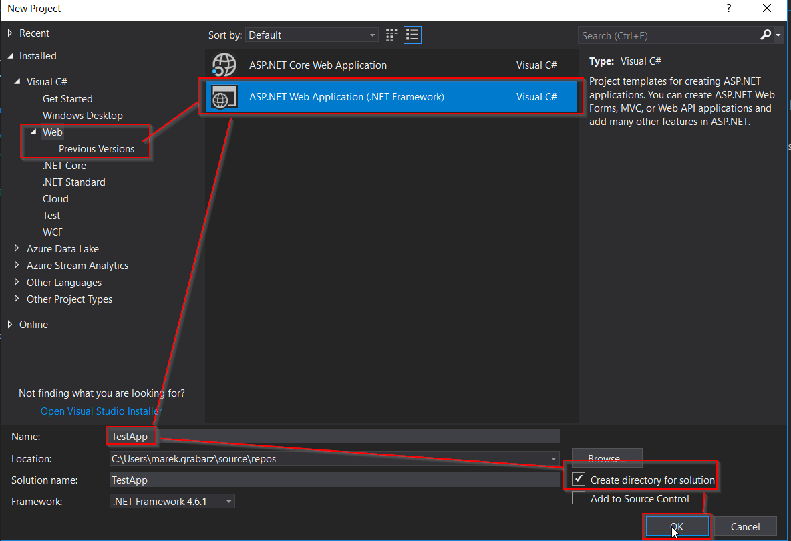
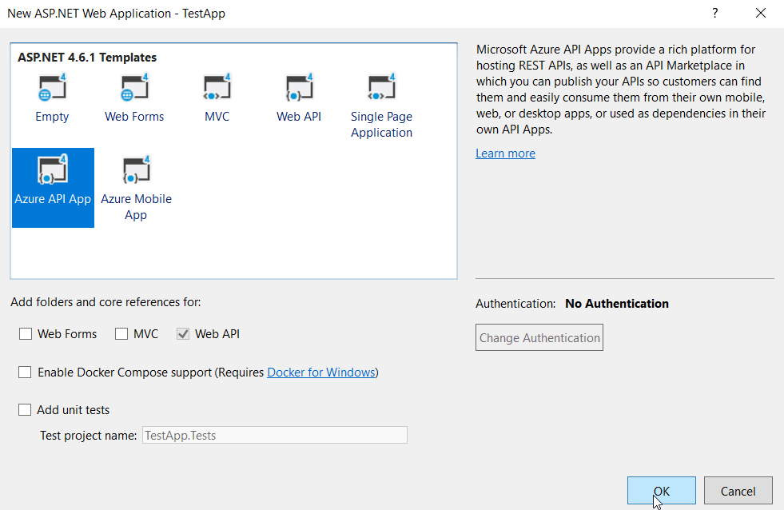
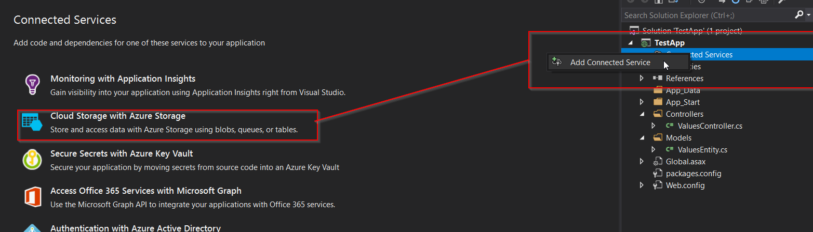
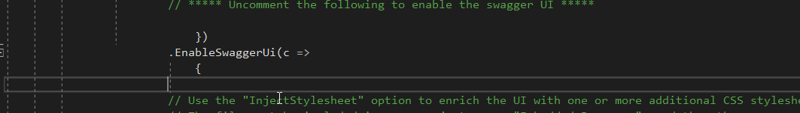
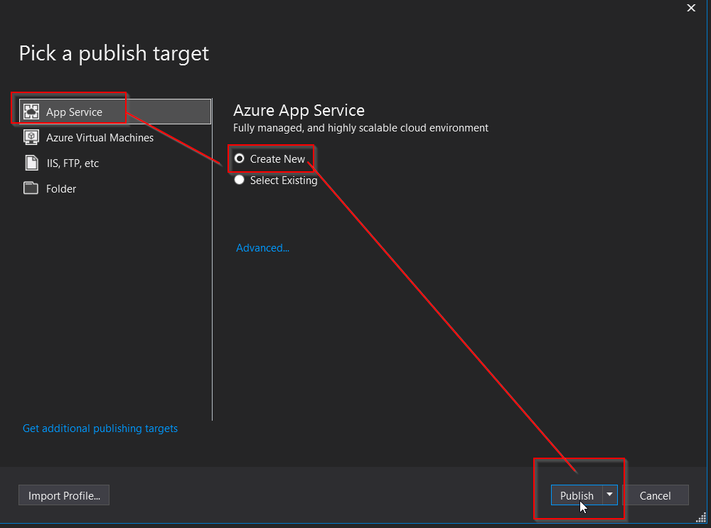
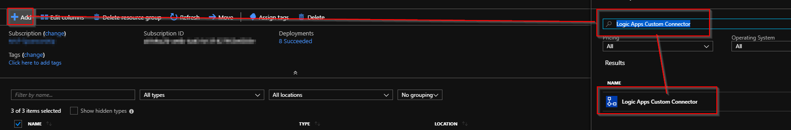
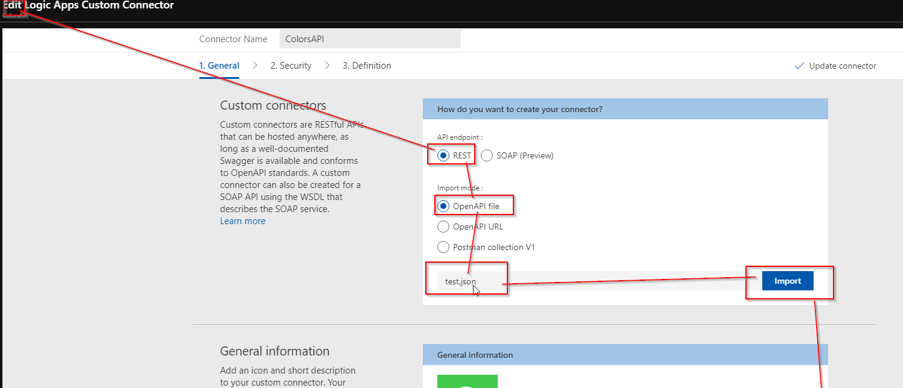
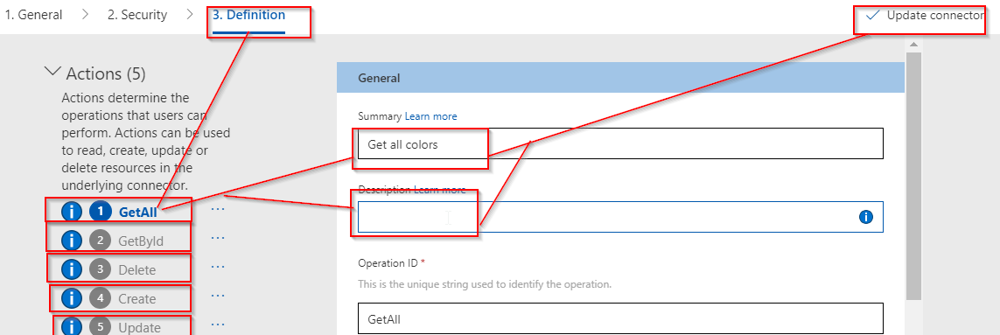
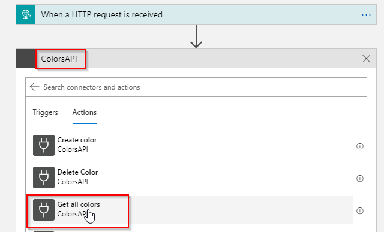
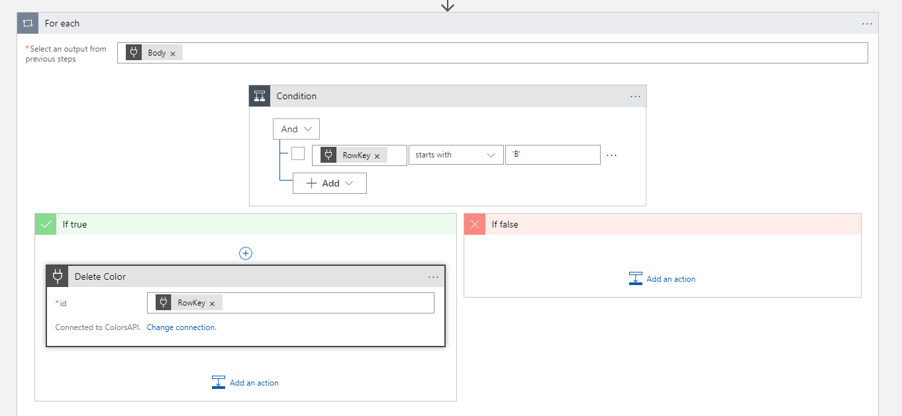

# Microsoft Azure LogicApps Workshop - Custom Connectors

## Exercise 1: Create an Azure API App ##

First step is to implement simple API that will be then used to create custom LogicApp connectors.

1. Open **Visual Studio 2017**
2. Click **File**, followed by **New** and **Project**.
3. From the list of available templates select "ASP.NET Web Application"
   
4. Use "API App" template 
   
5. Create storage account and add it to your API.
   
6. Add ValuesEntity class in Model folder. 
``` C#
using Microsoft.WindowsAzure.Storage.Table;

namespace TestApp.Models
{
    public class ValuesEntity : TableEntity
    {
        public ValuesEntity() { }

        public ValuesEntity(string category, string value)
        {
            this.PartitionKey = category;
            this.RowKey = value;

        }

        public string Translation { get; set; }

    }
}
```
7. Remove ValuesController and create ColorsController
8. Implement controller
``` C#
using System.Collections.Generic;
using System.Net;
using System.Web.Http;
using Microsoft.WindowsAzure.Storage;
using Microsoft.WindowsAzure.Storage.Table;
using Swashbuckle.Swagger.Annotations;
using TestApp.Models;

namespace TestApp.Controllers
{
    public class ColorsController : ApiController
    {
        CloudTable table;

        public ColorsController()
        {
            var storageAccount = CloudStorageAccount.Parse(Microsoft.Azure.CloudConfigurationManager.GetSetting("AzureStorageConnectionString-1"));
            var tableClient = storageAccount.CreateCloudTableClient();

            table = tableClient.GetTableReference("Values");
            table.CreateIfNotExists();
        }

        // GET api/colors
        [SwaggerOperation("GetAll")]
        public IEnumerable<ValuesEntity> Get()
        {
            TableQuery<ValuesEntity> query =new TableQuery<ValuesEntity>().Where(TableQuery.GenerateFilterCondition("PartitionKey", QueryComparisons.Equal, "Color"));

            List<ValuesEntity> colors = new List<ValuesEntity>();
            TableContinuationToken token = null;
            do
            {
                TableQuerySegment<ValuesEntity> resultSegment = table.ExecuteQuerySegmented(query, token);
                token = resultSegment.ContinuationToken;

                foreach (ValuesEntity color in resultSegment.Results)
                {
                    colors.Add(color);
                }
            } while (token != null);

            return colors;
        }

        // GET api/colors/Red
        [SwaggerOperation("GetById")]
        [SwaggerResponse(HttpStatusCode.OK)]
        [SwaggerResponse(HttpStatusCode.NotFound)]
        public ValuesEntity Get(string id)
        {
            TableOperation retrieveOperation = TableOperation.Retrieve<ValuesEntity>("Color", id);
            return table.Execute(retrieveOperation).Result as ValuesEntity;
        }

        // POST api/colors
        [SwaggerOperation("Create")]
        [SwaggerResponse(HttpStatusCode.Created)]
        public void Post([FromUri]string id, [FromUri]string translation)
        {
            var valueEntity = new ValuesEntity("Color", id)
            {
                Translation = translation
            };

            TableOperation insertOperation = TableOperation.Insert(valueEntity);
            table.Execute(insertOperation);
        }

        // PUT api/colors/Red
        [SwaggerOperation("Update")]
        [SwaggerResponse(HttpStatusCode.OK)]
        [SwaggerResponse(HttpStatusCode.NotFound)]
        public void Put(string id, [FromUri]string translation)
        {
            var color = Get(id);
            color.Translation = translation;

            TableOperation updateOperation = TableOperation.Replace(color);
            table.Execute(updateOperation);
        }

        // DELETE api/colors/Red
        [SwaggerOperation("Delete")]
        [SwaggerResponse(HttpStatusCode.OK)]
        [SwaggerResponse(HttpStatusCode.NotFound)]
        public void Delete(string id)
        {
            var deleteOperation = TableOperation.Delete(new ValuesEntity("Color", id) { ETag = "*" });
            table.Execute(deleteOperation);
        }
    }
}
```
1.  Edit App_Start/SwaggerConfig.cs and uncomment SwaggerUI section.
    
2.  Press Ctrl+F5 and play with SwaggerUI under http://localhost:port/swagger

## Exercise 2: Create custom connector for your API  ##

1. Publish your API App to Azure
   
2. Run your application and get swagger from following url https://yourAPIName.azurewebsites.net/swagger/docs/v1
3. Save swagger in json file.
4. Create Logic App Connector named ColorsAPI
   
5. Edit General tab of connector with json file containing your swagger.
   
6. In Security tab select "No authentication"
7. In Definition tab fill in method Summary and Description and press Update connector button.
     

## Exercise 3: Use your custom connector in Logic App  ##

1. Using SwaggerUI at https://yourAPIName.azurewebsites.net/swagger define couple of test colors (e.g. Blue, Black, Red, Yellow)
2. Create new logic app from HTTP Trigger template.
3. In Ation call "Get all colors" from ColorsAPI.
   
4. Foreach Result check if color name starts with "B" if Yes - Delete Color.
   
5. Test results using SwaggerUI.
## [UP](./../README.md)